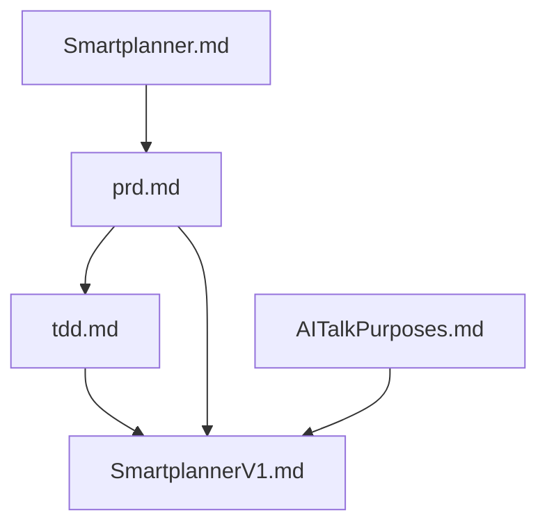

# SmartPlanner 项目结构说明

## 文档目录 (SmartPlannerDoc/)
### 迭代文档 (iteration_v1/)
- `SmartplannerV1.md` - 第一轮迭代具体需求和实现计划
  - 用户需求场景
  - 开发步骤建议
  - 技术要点
  - 项目结构设计
  
- `tddV1.md` - 技术设计文档
  - 系统架构设计
  - 数据模型设计
  - 核心类设计
  - 安全设计
  - 性能优化
  - 测试策略
  
- `prdV1.md` - 产品需求文档
  - 产品定位
  - 功能需求
  - 非功能需求
  - UI/UX设计规范
  - 兼容性要求
  - 发布计划

### 核心文档
- `Smartplanner.md` - 项目整体说明
  - 设计初衷
  - 核心功能模块
  - 技术架构
  - 前后端职责划分
  
- `AITalkPurposes.md` - 业务逻辑补充说明
  - 计划区间逻辑
  - 计划模板逻辑
  - 计划实例逻辑
  - 类别管理逻辑

## 源代码目录 (SmartPlanner/)
### App 入口
- `SmartPlannerApp.swift` - 应用程序入口文件

### 项目结构 (建议)
- `Models/` - 数据模型
  - 计划区间模型
  - 计划模型
  - 枚举定义
  - 数据模型扩展
  
- `Views/` - 视图层
  - 日历相关视图
  - 计划相关视图
  - 通用组件
  
- `ViewModels/` - 视图模型层
  - 日历视图模型
  - 计划视图模型
  
- `Services/` - 服务层
  - 数据管理服务
  - 通知管理服务
  
- `Utilities/` - 工具层
  - 扩展方法
  - 常量定义

## 文件依赖关系

## 版本控制
- `.gitignore` - Git忽略文件配置
- `LICENSE` - GNU General Public License v3.0
- `README.md` - 项目说明文档
- `ProjectStructure.md` - 项目结构说明文档
