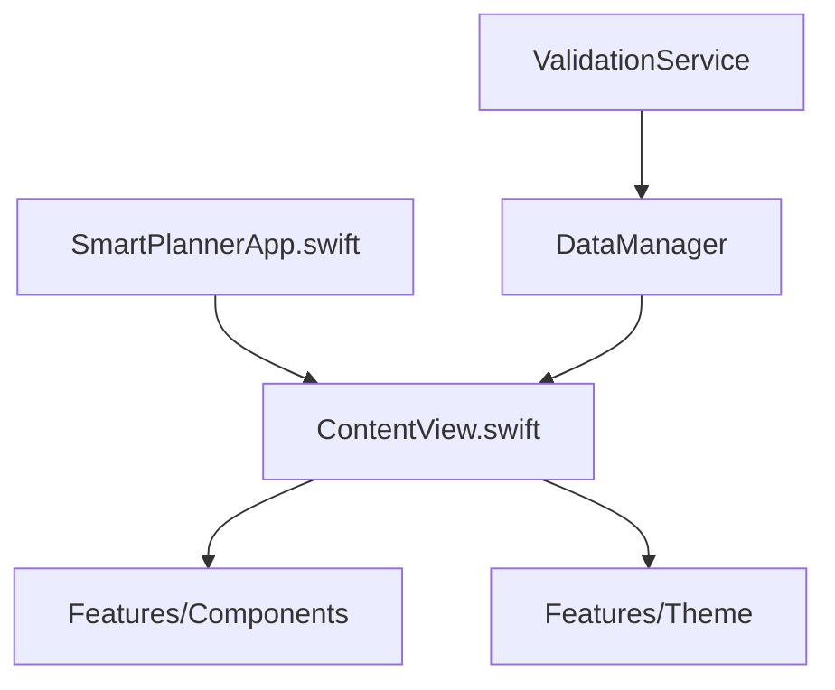
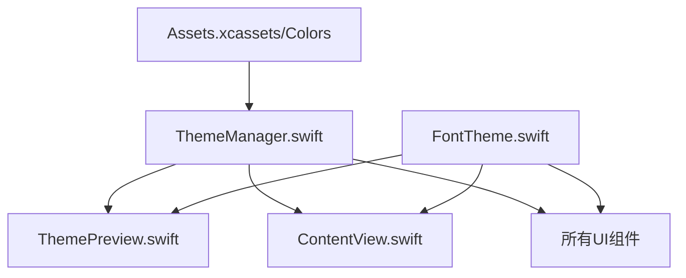
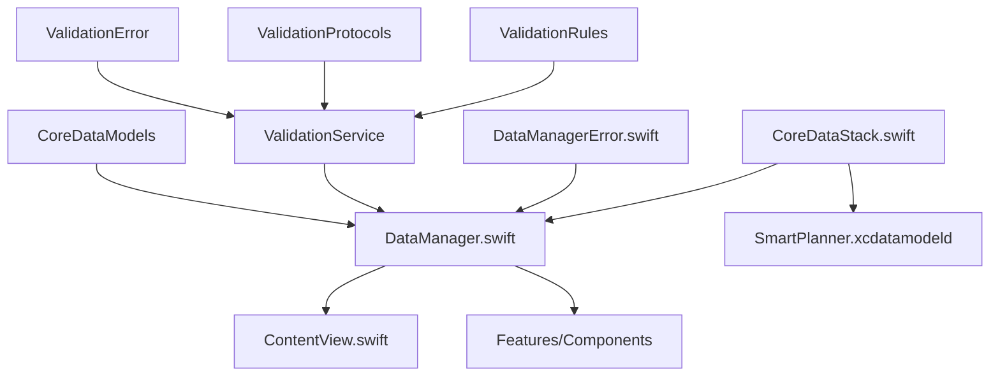
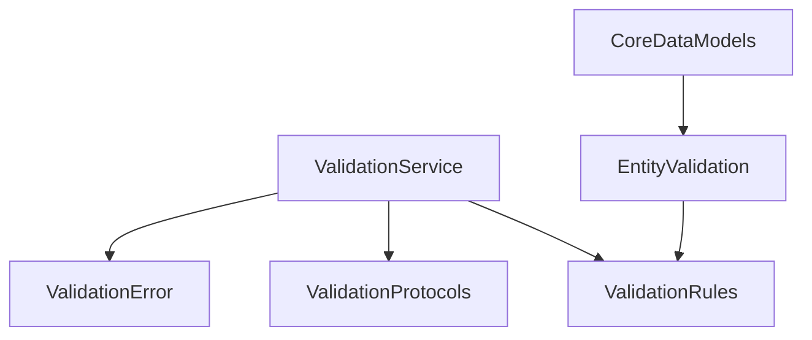
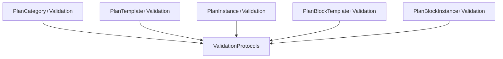
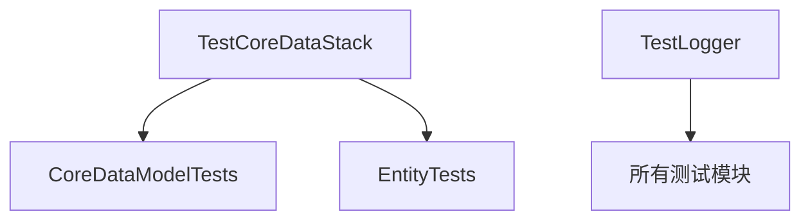

# SmartPlanner 项目结构

> 📝 **文档更新指南**
> 
> 本文档旨在准确反映项目的目录结构。更新本文档时，请遵循以下原则：
> 
> ### 基本原则
> 
> 1. **实际性原则**
>    - 只记录实际存在的目录和文件
>    - 不记录计划中但未创建的内容
>    - 使用 `find` 等命令验证文件存在
> 
> 2. **完整性原则**
>    - 从项目根目录开始记录
>    - 包含所有关键配置文件
>    - 完整展示目录层级关系
> 
> 3. **层次性原则**
>    - 使用缩进表示目录层级
>    - 保持结构的一致性
>    - 用空行分隔主要部分
> 
> 4. **及时性原则**
>    - 每次添加新目录或文件时及时更新
>    - 每周进行一次完整性检查
>    - 在重要版本发布前进行全面审查
> 
> 5. **依赖关系原则**
>    - 使用代码分析工具检查实际引用关系
>    - 验证 import 语句的完整性
>    - 确认双向依赖的必要性
>    - 定期检查循环依赖
>    - **记录每个关键文件的依赖信息**：
>      - 直接依赖（import的框架和模块）
>      - 被引用情况（哪些文���使用了该模块）
>      - 关键功能说明
>      - 修改风险评估
> 
> ### 更新步骤
> 
> 1. **收集信息**
>    ```bash
>    # 列出所有目录
>    find . -type d -not -path "*/\.*" | sort
>       
>    # 列出所有文件
>    find . -type f -not -path "*/\.*" | sort
>    ```
> 
> 2. **验证结构**
>    - 确认所有路径正确
>    - 验证文件实际存在
>    - 检查注释准确性
> 
> 3. **保持格式**
>    - 使用统一的注释风格（如 `# 说明文字`）
>    - 遵循既定的树形结构格式
>    - 保持文档各部分的顺序
> 
> 4. **定期检查**
>    - 使用版本控制工具对比变更
>    - 检查新增文件是否已记录
>    - 验证文件依赖关系的准确性
>    - 更新修改风险评估
> 
> 5. **依赖关系更新**
>    - **分析代码依赖**
>      ```bash
>      # 查找所有 import 语句
>      grep -r "^import" . --include="*.swift"
>      
>      # 查找文件引用
>      grep -r "class\|struct\|protocol\|extension" . --include="*.swift"
>      ```
>    
>    - **验证依赖关系**
>      - 检查每个模块的直接依赖
>      - 验证依赖的必要性
>      - 识别潜在的循环依赖
>      - 评估依赖的影响范围
>    
>    - **更新依赖图**
>      - 使用 Mermaid 语法更新依赖图
>      - 确保图表反映最新状态
>      - 添加新的依赖关系
>      - 移除过时的依赖
>    
>    - **依赖说明格式**
>      ```markdown
>      ### 模块名称
>      - **直接依赖**
>        - 框架：[依赖的框架列表]
>        - 内部模块：[依赖的内部模块]
>      - **被引用**
>        - [引用该模块的文件列表]
>      - **关键功能**
>        - [核心功能说明]
>      - **修改风险**
>        - 风险等级：[高/中/低]
>        - 原因：[风险原因]
>      ```
>    
>    - **风险评估**
>      - 更新修改风险等级
>      - 评估依赖变更影响
>      - 提供修改建议
>      - 记录潜在问题
>
> ---

## 目录结构

```
SmartPlannerProject/                # 项目根目录
├── .git/                          # Git版本控制目录
├── .gitignore                     # Git忽略配置文件
├── LICENSE                        # 开源许可证
├── README.md                      # 项目说明文档
├── ProjectStructure.md            # 项目结构文档
│
├── SmartPlannerDoc/               # 项目文档
│   ├── Development_Progress.md    # 开发进度记录
│   ├── Smartplanner.md           # 项目概述
│   ├── GitCommitPrinciple.md     # Git提交规范
│   ├── CodingPrinciples.md       # 编码规范
│   └── iteration_v1/             # 第一轮迭代文档
│       ├── DevelopmentGuideV1.md        # 开发指南
│       ├── DatabaseDesignV1.md          # 数据库设计文档
│       ├── DataValidationImplementationPlan.md  # 数据验证实现计划
│       ├── ValidationRulesRecord.md     # 验证规则记录
│       ├── prdV1.md                     # 产品需求文档
│       └── tddV1.md                     # 技术设计文档
│
├── SmartPlanner/                 # Xcode项目目录
│   ├── SmartPlanner.xcodeproj/  # Xcode项目配置
│   │   └── project.pbxproj      # 项目配置文件
│   │
│   ├── SmartPlanner/            # 主项目目录
│   │   ├── Application/        # 应用程序入口
│   │   │   ├── SmartPlannerApp.swift  # 应用程序入口点
│   │   │   └── ContentView.swift      # 主内容视图
│   │   │
│   │   ├── Features/           # 功能模块
│   │   │   ├── Components/     # UI组件
│   │   │   │   ├── Atoms/     # 原子组件
│   │   │   │   ├── Molecules/ # 分子组件
│   │   │   │   └── Organisms/ # 有机体组件
│   │   │   └── Theme/         # 主题系统
│   │   │       ├── FontTheme.swift    # 字体主题
│   │   │       ├── ThemeManager.swift # 主题管理
│   │   │       └── ThemePreview.swift # 主题预览
│   │   │
│   │   ├── Models/            # 数据模型
│   │   │   ├── CoreDataModels/  # Core Data实体
│   │   │   │   ├── PlanCategory+CoreDataClass.swift
│   │   │   │   ├── PlanCategory+CoreDataProperties.swift
│   │   │   │   ├── PlanTemplate+CoreDataClass.swift
│   │   │   │   ├── PlanTemplate+CoreDataProperties.swift
│   │   │   │   ├── PlanInstance+CoreDataClass.swift
│   │   │   │   ├── PlanInstance+CoreDataProperties.swift
│   │   │   │   ├── PlanBlockTemplate+CoreDataClass.swift
│   │   │   │   ├── PlanBlockTemplate+CoreDataProperties.swift
│   │   │   │   ├── PlanBlockInstance+CoreDataClass.swift
│   │   │   │   └── PlanBlockInstance+CoreDataProperties.swift
│   │   │   ├── Validation/     # 数据验证
│   │   │   │   ├── PlanCategory+Validation.swift
│   │   │   │   ├── PlanTemplate+Validation.swift
│   │   │   │   ├── PlanInstance+Validation.swift
│   │   │   │   ├── PlanBlockTemplate+Validation.swift
│   │   │   │   └── PlanBlockInstance+Validation.swift
│   │   │   └── SmartPlanner.xcdatamodeld/  # Core Data模型文件
│   │   │
│   │   ├── Resources/         # 资源文件
│   │   │   ├── Assets.xcassets/  # 资源目录
│   │   │   │   ├── AppIcon.appiconset/      # 应用图标
│   │   │   │   ├── AccentColor.colorset/    # 强调色
│   │   │   │   └── Colors/                  # 颜色资源
│   │   │   │       ├── AppPrimaryColor.colorset
│   │   │   │       ├── AppSecondaryColor.colorset
│   │   │   │       ├── BackgroundColor.colorset
│   │   │   │       ├── SecondaryBackgroundColor.colorset
│   │   │   │       ├── PrimaryTextColor.colorset
│   │   │   │       ├── SecondaryTextColor.colorset
│   │   │   │       ├── WorkBlockColor.colorset
│   │   │   │       ├── PersonalBlockColor.colorset
│   │   │   │       ├── SuccessColor.colorset
│   │   │   │       ├── WarningColor.colorset
│   │   │   │       └── ErrorColor.colorset
│   │   │   └── Preview Content/  # 预览资源
│   │   │       └── Preview Assets.xcassets
│   │   │
│   │   ├── Services/          # 服务层
│   │   │   └── DataManager/   # 数据管理服务
│   │   │       ├── CoreDataStack.swift   # Core Data基础设施
│   │   │       ├── DataManager.swift     # 数据管理器
│   │   │       ├── DataManagerError.swift # 错误类型定义
│   │   │       └── Validation/           # 验证服务
│   │   │           ├── ValidationError.swift    # 验证错误
│   │   │           ├── ValidationProtocols.swift # 验证协议
│   │   │           └── ValidationRules.swift    # 验证规则
│   │   │
│   │   └── Utilities/         # 工具类
│   │       └── Logger/        # 日志工具
│   │           └── SPLogger.swift  # 日志管理器
│   │
│   ├── SmartPlannerTests/     # 单元测试
│   │   ├── Features/          # 功能测试
│   │   │   └── Theme/         # 主题测试
│   │   │       └── ThemeTests.swift
│   │   ├── Models/           # 模型测试
│   │   │   └── CoreDataTests/  # Core Data测试
│   │   │       ├── CoreDataModelTests.swift
│   │   │       └── EntityTests/
│   │   │           └── PlanCategoryTests.swift
│   │   ├── Services/         # 服务测试
│   │   │   └── CoreData/     # Core Data服务测试
│   │   ├── TestHelpers/      # 测试辅助工具
│   │   │   ├── TestLogger.swift
│   │   │   └── TestCoreDataStack.swift
│   │   └── SmartPlannerTests.swift  # 测试入口
│   │
│   └── SmartPlannerUITests/   # UI测试
│       ├── SmartPlannerUITests.swift
│       └── SmartPlannerUITestsLaunchTests.swift
```

## 文件命名规范

1. **Swift 文件**
   - 使用 PascalCase
   - 遵循功能+类型的命名方式
   - 例如：`ThemeManager.swift`, `ColorTheme.swift`

2. **资源文件**
   - 使用 PascalCase
   - 遵循功能+类型的命名方式
   - 例如：`PrimaryColor.colorset`, `AppIcon.appiconset`

3. **测试文件**
   - 使用被测试类名+Tests的命名方式
   - 例如：`ThemeTests.swift`, `PlanCategoryTests.swift`

## 模块说明

1. **Models**
   - Core Data 实体定义（计划、类别、区间等）
   - 数据模型及其属性
   - 模型扩展和协议

2. **Services**
   - 数据持久化服务
   - Core Data 基础设施
   - 错误处理机制

3. **Theme**
   - 颜色主题管理
   - 字体主题管理
   - 主题预览功能
   - 深色模式支持

4. **Components**
   - Atoms: 最基本的UI组件
   - Molecules: 由多个Atoms组成的复杂组件
   - Organisms: 由多个Molecules组成的功能完整的组件
   - Foundations: 基础样式和设计系统

5. **Utilities**
   - 工具类
   - 辅助功能

6. **Views & ViewModels**
   - 视图层实现
   - 视图数据处理
   - 业务逻辑封装

7. **Tests**
   - 单元测试（Models, Services, Theme等）
   - UI测试
   - 测试辅助工具

## 文件依赖关系

### 1. 核心依赖

#### 1.1 应用层依赖


#### 1.2 主题系统


#### 1.3 数据层


### 2. 验证系统依赖

#### 2.1 验证服务


#### 2.2 实体验证


### 3. 测试依赖

#### 3.1 测试工具


### 4. 核心模块依赖说明

#### ValidationService
- **直接依赖**
  - 框架：Foundation, CoreData
  - 内部模块：
    - ValidationRules
    - ValidationProtocols
    - ValidationError
    - CoreDataModels
- **被引用**
  - DataManager
  - EntityValidation扩展
- **关键功能**
  - 数据验证规则管理
  - 验证执行
  - 错误处理
- **修改风险**：高（影响数据完整性）

#### ValidationRules
- **直接依赖**
  - 框架：Foundation, CoreData
  - 内部模块：ValidationProtocols
- **被引用**
  - ValidationService
  - EntityValidation扩展
- **关键功能**
  - 定义验证规则
  - 规则执行逻辑
- **修改风险**：中（规则变更影响验证）

#### ValidationProtocols
- **直接依赖**
  - 框架：Foundation, CoreData
- **被引用**
  - ValidationService
  - ValidationRules
  - EntityValidation扩展
- **关键功能**
  - 定义验证接口
  - 统一验证行为
- **修改风险**：高（接口变更影响全局）

#### EntityValidation扩展
- **直接依赖**
  - 框架：Foundation, CoreData
  - 内部模块：
    - ValidationProtocols
    - ValidationRules
- **被引用**
  - 各个Core Data实体
- **关键功能**
  - 实体特定验证逻辑
  - 自定义验证规则
- **修改风险**：中（影响特定实体）

### 5. 其他核心模块依赖

#### Application 模块

##### SmartPlannerApp.swift
- **直接依赖**
  - 框架：SwiftUI
  - 内部模块：ContentView
- **被引用**：无（应用入口点）
- **关键功能**
  - 应用程序生命周期管理
  - 全局状态初始化
- **修改风险**：高（影响整个应用）

##### ContentView.swift
- **直接依赖**
  - 框架：SwiftUI
  - 内部模块：
    - Features/Theme
    - Features/Components
    - DataManager
- **被引用**
  - SmartPlannerApp.swift
- **关键功能**
  - 主视图结构
  - 导航管理
- **修改风险**：高（核心UI结构）

#### Services 模块

##### DataManager.swift
- **直接依赖**
  - 框架：CoreData, Combine
  - 内部模块：
    - CoreDataStack
    - DataManagerError
    - ValidationService
- **被引用**
  - ContentView
  - Features/Components
  - 测试文件
- **关键功能**
  - CRUD 操作
  - 数据持久化
  - 异步数据处理
  - 数据验证
- **修改风险**：高（数据层核心）

##### CoreDataStack.swift
- **直接依赖**
  - 框架：CoreData
  - 内部模块：SmartPlanner.xcdatamodeld
- **被引用**
  - DataManager
  - TestCoreDataStack
- **关键功能**
  - 持久化存储管理
  - 上下文管理
- **修改风险**：高（数据基础设施）

#### Features 模块

##### ThemeManager.swift
- **直接依赖**
  - 框架：SwiftUI, Combine
  - 资源：Assets.xcassets/Colors
- **被引用**
  - ContentView
  - 所有UI组件
- **关键功能**
  - 主题切换
  - 颜色管理
  - 深色模式支持
- **修改风险**：高（影响所有UI）

##### FontTheme.swift
- **直接依赖**
  - 框架：SwiftUI
- **被引用**
  - ThemeManager
  - UI组件
- **关键功能**
  - 字体定义
  - 文本样式
- **修改风险**：中（UI风格）

#### Models 模块

##### CoreData 实体
- **直接依赖**
  - 框架：CoreData, Foundation
  - 内部模块：
    - ValidationProtocols
    - ValidationRules
- **被引用**
  - DataManager
  - ValidationService
  - 实体测试
- **关键功能**
  - 数据结构定义
  - 关系映射
  - 数据验证
- **修改风险**：高（数据模型）

#### Utilities 模块

##### SPLogger.swift
- **直接依赖**
  - 框架：Foundation, os.log
- **被引用**
  - 全局使用
- **关键功能**
  - 日志记录
  - 调试支持
  - 性能监控
- **修改风险**：低（工具类）

### 6. 修改风险评估

1. **高风险模块**：
   - `Application/`
     - SmartPlannerApp.swift（应用入口点）
     - ContentView.swift（主视图）
   - `Features/Theme/`
     - ThemeManager.swift（主题管理）
   - `Services/DataManager/`
     - CoreDataStack.swift（数据层核心）
     - DataManager.swift（数据管理）
     - ValidationService（数据验证）
   - `Models/CoreDataModels/`（数据实体）
   - `Models/Validation/`（验证规则）

2. **中等风险模块**：
   - `Features/Components/`（UI组件）
   - `Resources/Assets.xcassets/`（资源文件）
   - `Services/DataManager/Validation/`（验证规则）
   - `Models/Validation/`（实体验证扩展）

3. **低风险模块**：
   - `Utilities/Logger/`（日志工具）
   - `SmartPlannerTests/`（测试代码）
   - `SmartPlannerUITests/`（UI测试）
   - 文档文件

### 7. 开发建议

1. **新功能开发**：
   - 在 `Features/` 下创建新的功能模块
   - 遵循组件化开发模式
   - 确保主题系统的一致性
   - 同步更新测试用例
   - 实现相应的验证规则

2. **代码组织**：
   - 保持目录结构清晰
   - 遵循 MVVM 架构模式
   - 合理使用依赖注入
   - 避免循环依赖
   - 分离验证逻辑

3. **测试策略**：
   - 单元测试覆盖核心逻辑
   - UI测试关注关键流程
   - 使用 TestHelpers 提高测试效率
   - 保持测试代码的可维护性
   - 验证规则测试覆盖

4. **性能优化**：
   - 监控 Core Data 性能
   - 优化资源加载
   - 注意内存管理
   - 实现必要的缓存机制
   - 优化验证性能
