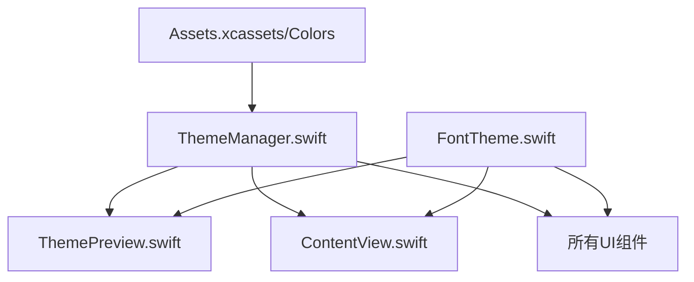
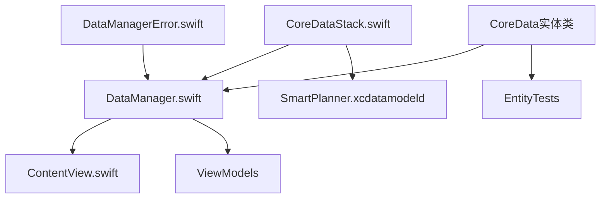
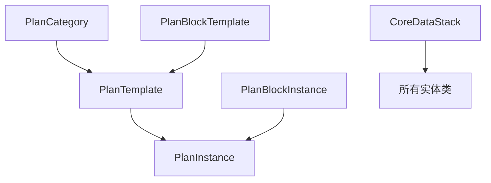
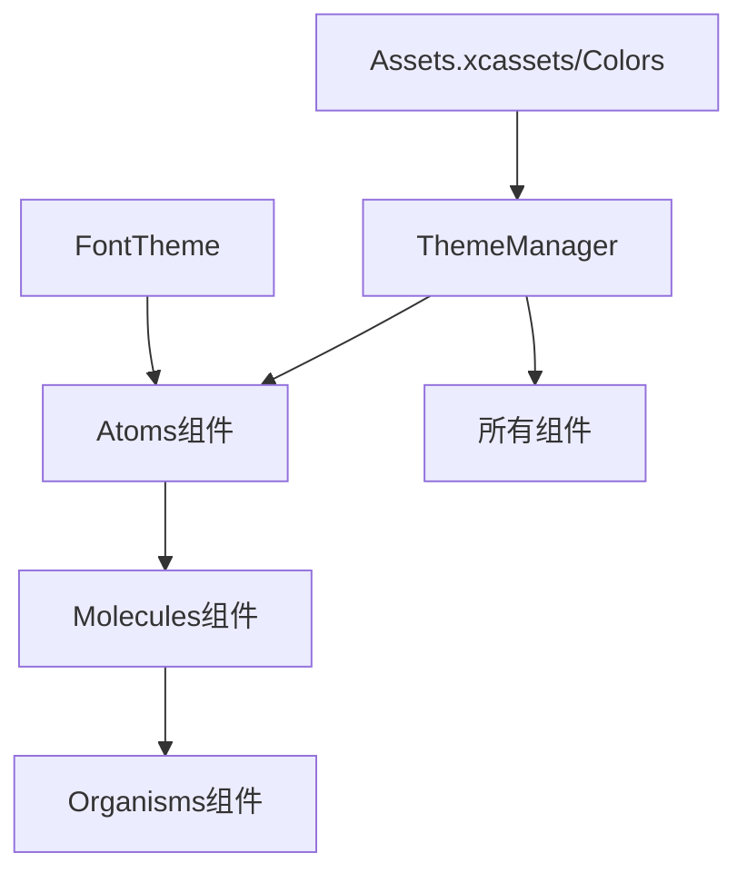
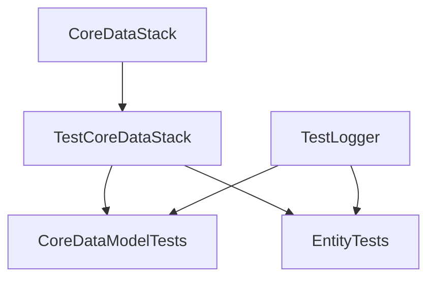

# SmartPlanner 项目结构

> 📝 **文档更新指南**
> 
> 本文档旨在准确反映项目的目录结构。更新本文档时，请遵循以下原则：
> 
> ### 基本原则
> 
> 1. **实际性原则**
>    - 只记录实际存在的目录和文件
>    - 不记录计划中但未创建的内容
>    - 使用 `find` 等命令验证文件存在
> 
> 2. **完整性原则**
>    - 从项目根目录开始记录
>    - 包含所有关键配置文件
>    - 完整展示目录层级关系
> 
> 3. **层次性原则**
>    - 使用缩进表示目录层级
>    - 保持结构的一致性
>    - 用空行分隔主要部分
> 
> 4. **及时性原则**
>    - 每次添加新目录或文件时及时更新
>    - 每周进行一次完整性检查
>    - 在重要版本发布前进行全面审查
> 
> 5. **依赖关系原则**
>    - 使用代码分析工具检查实际引用关系
>    - 验证 import 语句的完整性
>    - 确认双向依赖的必要性
>    - 定期检查循环依赖
> 
> ### 更新步骤
> 
> 1. **收集信息**
>    ```bash
>    # 列出所有目录
>    find . -type d -not -path "*/\.*" | sort
>       
>    # 列出所有文件
>    find . -type f -not -path "*/\.*" | sort
>    ```
> 
> 2. **验证结构**
>    - 确认所有路径正确
>    - 验证文件实际存在
>    - 检查注释准确性
> 
> 3. **保持格式**
>    - 使用统一的注释风格（如 `# 说明文字`）
>    - 遵循既定的树形结构格式
>    - 保持文档各部分的顺序
> 
> 4. **定期检查**
>    - 使用版本控制工具对比变更
>    - 检查新增文件是否已记录
>    - 验证文件依赖关系的准确性
>    - 更新修改风险评估
> 
> 5. **依赖关系更新**
>    - **分析代码依赖**
>      ```bash
>      # 查找所有 import 语句
>      grep -r "^import" . --include="*.swift"
>      
>      # 查找文件引用
>      grep -r "class\|struct\|protocol\|extension" . --include="*.swift"
>      ```
>    
>    - **验证依赖关系**
>      - 检查每个模块的直接依赖
>      - 验证依赖的必要性
>      - 识别潜在的循环依赖
>      - 评估依赖的影响范围
>    
>    - **更新依赖图**
>      - 使用 Mermaid 语法更新依赖图
>      - 确保图表反映最新状态
>      - 添加新的依赖关系
>      - 移除过时的依赖
>    
>    - **风险评估**
>      - 更新修改风险等级
>      - 评估依赖变更影响
>      - 提供修改建议
>      - 记录潜在问题
>
> ---

## 目录结构

```
SmartPlannerProject/                # 项目根目录
├── .git/                          # Git版本控制目录
├── .gitignore                     # Git忽略配置文件
├── LICENSE                        # 开源许可证
├── README.md                      # 项目说明文档
├── ProjectStructure.md            # 项目结构文档
│
├── SmartPlannerDoc/               # 项目文档
│   ├── Development_Progress.md    # 开发进度记录
│   ├── Smartplanner.md           # 项目概述
│   ├── GitCommitPrinciple.md     # Git提交规范
│   ├── CodingPrinciples.md       # 编码规范
│   └── iteration_v1/             # 第一轮迭代文档
│       ├── DevelopmentGuideV1.md # 开发指南
│       ├── DatabaseDesignV1.md   # 数据库设计文档
│       ├── prdV1.md             # 产品需求文档
│       └── tddV1.md             # 技术设计文档
│
├── SmartPlanner/                 # Xcode项目目录
│   ├── SmartPlanner.xcodeproj/  # Xcode项目配置
│   │   ├── project.pbxproj      # 项目配置文件
│   │   ├── project.xcworkspace/ # 工作空间配置
│   │   │   ├── contents.xcworkspacedata
│   │   │   └── xcshareddata/    # 共享配置
│   │   │       └── swiftpm/     # Swift包管理器配置
│   │   └── xcuserdata/         # 用户特定配置
│   │
│   ├── SmartPlanner/            # 主项目目录
│   │   ├── Models/              # 模型层
│   │   │   ├── CoreDataModels/  # Core Data 实体
│   │   │   │   ├── PlanCategory+CoreDataClass.swift
│   │   │   │   ├── PlanCategory+CoreDataProperties.swift
│   │   │   │   ├── PlanTemplate+CoreDataClass.swift
│   │   │   │   ├── PlanTemplate+CoreDataProperties.swift
│   │   │   │   ├── PlanInstance+CoreDataClass.swift
│   │   │   │   ├── PlanInstance+CoreDataProperties.swift
│   │   │   │   ├── PlanBlockTemplate+CoreDataClass.swift
│   │   │   │   ├── PlanBlockTemplate+CoreDataProperties.swift
│   │   │   │   ├── PlanBlockInstance+CoreDataClass.swift
│   │   │   │   └── PlanBlockInstance+CoreDataProperties.swift
│   │   │   ├── Enums/          # 枚举定义
│   │   │   ├── Extensions/     # 模型扩展
│   │   │   ├── Helpers/        # 辅助工具类
│   │   │   └── Protocols/      # 协议定义
│   │   │
│   │   ├── Services/           # 服务层
│   │   │   └── DataManager/    # 数据管理服务
│   │   │       ├── CoreDataStack.swift   # Core Data基础设施
│   │   │       ├── DataManager.swift     # 数据管理器
│   │   │       └── DataManagerError.swift # 错误类型定义
│   │   │
│   │   ├── Theme/              # 主题系统
│   │   │   ├── FontTheme.swift          # 字体主题定义
│   │   │   ├── ThemeManager.swift       # 主题管理器
│   │   │   └── ThemePreview.swift       # 主题预览视图
│   │   │
│   │   ├── Components/         # 组件
│   │   │   ├── Atoms/         # 原子组件
│   │   │   │   └── Inputs/    # 输入组件
│   │   │   ├── Molecules/     # 分子组件
│   │   │   │   ├── Cards/     # 卡片组件
│   │   │   │   └── ListItems/ # 列表项组件
│   │   │   ├── Organisms/     # 有机体组件
│   │   │   │   ├── Calendar/  # 日历组件
│   │   │   │   └── Forms/     # 表单组件
│   │   │   └── Foundations/   # 基础组件
│   │   │       └── Styles/    # 样式定义
│   │   │
│   │   ├── Utilities/         # 工具层
│   │   ├── ViewModels/        # 视图模型层
│   │   ├── Views/             # 视图层
│   │   │
│   │   ├── Assets.xcassets/   # 资源文件
│   │   │   ├── AppIcon.appiconset/      # 应用图标
│   │   │   ├── AccentColor.colorset/    # 强调色
│   │   │   └── Colors/                  # 颜色资源
│   │   │       ├── PrimaryColor.colorset
│   │   │       ├── SecondaryColor.colorset
│   │   │       ├── BackgroundColor.colorset
│   │   │       ├── SecondaryBackgroundColor.colorset
│   │   │       ├── PrimaryTextColor.colorset
│   │   │       ├── SecondaryTextColor.colorset
│   │   │       ├── WorkBlockColor.colorset
│   │   │       ├── PersonalBlockColor.colorset
│   │   │       ├── SuccessColor.colorset
│   │   │       ├── WarningColor.colorset
│   │   │       └── ErrorColor.colorset
│   │   │
│   │   ├── Preview Content/   # 预览内容
│   │   │   └── Preview Assets.xcassets
│   │   │
│   │   ├── SmartPlanner.xcdatamodeld/  # Core Data模型文件
│   │   │   └── SmartPlanner.xcdatamodel # 数据模型定义
│   │   │       └── contents             # 数据模型内容
│   │   │
│   │   ├── ContentView.swift           # 主内容视图
│   │   └── SmartPlannerApp.swift       # 应用程序入口
│   │
│   ├── SmartPlannerTests/              # 单元测试目录
│   │   ├── Models/                     # 模型测试
│   │   │   └── CoreDataTests/          # Core Data测试
│   │   │       ├── CoreDataModelTests.swift # 核心数据模型测试
│   │   │       └── EntityTests/        # 实体测试
│   │   │           └── PlanCategoryTests.swift
│   │   ├── Services/                   # 服务测试
│   │   │   └── CoreData/              # Core Data服务测试
│   │   ├── Theme/                     # 主题系统测试
│   │   │   └── ThemeTests.swift       # 主题功能测试
│   │   ├── Views/                     # 视图测试
│   │   ├── ViewModels/                # 视图模型测试
│   │   ├── Helpers/                   # 辅助工具测试
│   │   ├── TestHelpers/               # 测试辅助工具
│   │   │   ├── TestLogger.swift       # 测试日志工具
│   │   │   └── TestCoreDataStack.swift # 测试数据栈
│   │   └── SmartPlannerTests.swift    # 测试入口文件
│   │
│   └── SmartPlannerUITests/           # UI测试目录
│       ├── SmartPlannerUITests.swift          # UI测试用例
│       └── SmartPlannerUITestsLaunchTests.swift # 启动测试
```

## 文件命名规范

1. **Swift 文件**
   - 使用 PascalCase
   - 遵循功能+类型的命名方式
   - 例如：`ThemeManager.swift`, `ColorTheme.swift`

2. **资源文件**
   - 使用 PascalCase
   - 遵循功能+类型的命名方式
   - 例如：`PrimaryColor.colorset`, `AppIcon.appiconset`

3. **测试文件**
   - 使用被测试类名+Tests的命名方式
   - 例如：`ThemeTests.swift`, `PlanCategoryTests.swift`

## 模块说明

1. **Models**
   - Core Data 实体定义（计划、类别、区间等）
   - 数据模型及其属性
   - 模型扩展和协议

2. **Services**
   - 数据持久化服务
   - Core Data 基础设施
   - 错误处理机制

3. **Theme**
   - 颜色主题管理
   - 字体主题管理
   - 主题预览功能
   - 深色模式支持

4. **Components**
   - Atoms: 最基本的UI组件
   - Molecules: 由多个Atoms组成的复杂组件
   - Organisms: 由多个Molecules组成的功能完整的组件
   - Foundations: 基础样式和设计系统

5. **Utilities**
   - 工具类
   - 辅助功能

6. **Views & ViewModels**
   - 视图层实现
   - 视图数据处理
   - 业务逻辑封装

7. **Tests**
   - 单元测试（Models, Services, Theme等）
   - UI测试
   - 测试辅助工具

## 文件依赖关系

### 1. 核心依赖

#### 1.1 主题系统


- **ThemeManager.swift**
  - 依赖关系:
    - SwiftUI
    - Combine
    - UIKit (用于系统外观设置)
    - Assets.xcassets (颜色资源)
  - 被引用者:
    - ThemePreview.swift
    - ContentView.swift
    - 所有UI组件
  - 关键功能:
    - 主题类型管理（系统、浅色、深色、自定义）
    - 深色模式切换
    - 主题状态持久化
    - 系统外观自动适配
  - 修改风险: 高（核心功能）
  - 修改建议:
    - 保持主题类型枚举的稳定性
    - 谨慎修改颜色键名定义
    - 确保主题切换的性能
    - 维护颜色资源的一致性

- **FontTheme.swift**
  - 依赖关系:
    - SwiftUI
  - 被引用者:
    - ThemePreview.swift
    - ContentView.swift
    - 所有UI组件
  - 修改风险: 高（多处引用）
  - 修改建议:
    - 避免修改已定义的字体常量名称
    - 新增字体时考虑可访问性
    - 保持字体大小的层级关系

- **ThemePreview.swift**
  - 依赖关系:
    - SwiftUI
    - ThemeManager
    - FontTheme
  - 关键功能:
    - 主题切换界面
    - 颜色预览
    - 字体预览
  - 修改风险: 低（独立功能）
  - 修改建议:
    - 可以自由优化UI布局
    - 添加新的预览功能
    - 改进用户交互体验

#### 1.2 数据层


- **CoreDataStack.swift**
  - 依赖关系:
    - CoreData
    - SmartPlanner.xcdatamodeld
  - 被引用者:
    - DataManager.swift
    - TestCoreDataStack.swift
  - 关键功能:
    - 管理持久化容器
    - 提供主线程和后台线程上下文
    - 处理数据存储错误
  - 修改风险: 高（核心基础设施）
  - 修改建议:
    - 保持单例模式的实现
    - 谨慎修改错误处理逻辑
    - 维护线程安全性

- **DataManager.swift**
  - 依赖关系:
    - CoreData
    - Combine
    - CoreDataStack.swift
    - DataManagerError.swift
  - 被引用者:
    - ViewModels
    - Views
    - 测试文件
  - 关键功能:
    - CRUD 操作封装
    - 异步数据操作支持
    - 后台任务处理
  - 修改风险: 中（接口稳定）
  - 修改建议:
    - 保持 API 接口稳定
    - 可以添加新的查询方法
    - 优化批量操作性能

- **DataManagerError.swift**
  - 依赖关系:
    - Foundation
  - 被引用者:
    - DataManager.swift
  - 修改风险: 低
  - 修改建议:
    - 可以添加新的错误类型
    - 保持错误描述的清晰性
    - 考虑国际化支持

#### 1.3 数据模型


- **CoreData 实体类**
  - 依赖关系:
    - CoreData
    - 相关联的其他实体类
  - 被引用者:
    - DataManager.swift
    - 实体测试文件
    - 相关视图模型
  - 实体关系:
    - PlanCategory (1) -> (n) PlanTemplate
    - PlanTemplate (1) -> (n) PlanInstance
    - PlanTemplate (1) -> (n) PlanBlockTemplate
    - PlanInstance (1) -> (n) PlanBlockInstance
  - 修改风险: 高（数据结构核心）
  - 修改建议:
    - 添加新属性时考虑数据迁移
    - 保持实体关系的一致性
    - 考虑���询性能优化

### 2. 视图层依赖

#### 2.1 基础组件


- **Atoms 组件**
  - 依赖关系:
    - SwiftUI
    - ThemeManager
    - FontTheme
  - 设计原则:
    - 保持组件的原子性
    - 统一的样式系统
    - 可复用性优先
  - 修改建议:
    - 组件接口保持稳定
    - 支持主题切换
    - 添加必要的自定义选项

- **Molecules 组件**
  - 依赖关系:
    - Atoms 组件
    - 业务逻辑接口
  - 设计原则:
    - 组合原子组件
    - 处理简单的业务逻辑
    - 保持组件独立性
  - 修改建议:
    - 明确组件职责
    - 避免过度耦合
    - 考虑性能优化

- **Organisms 组件**
  - 依赖关系:
    - Molecules 组件
    - 业务逻辑
    - 数据模型
  - 设计原则:
    - 实现完整的业务功能
    - 管理复杂的状态
    - 处理用户交互
  - 修改建议:
    - 合理拆分大型组件
    - 实现必要的缓存机制
    - 优化重绘性能

### 3. 测试依赖

#### 3.1 测试辅助工具


- **TestCoreDataStack.swift**
  - 依赖关系:
    - CoreData
    - CoreDataStack
  - 被引用者:
    - 所有 CoreData 相关测试
  - 关键功能:
    - 提供内存数据存储
    - 隔离测试环境
    - 支持数据重置
  - 修改建议:
    - 保持测试隔离性
    - 添加性能测试支持
    - 完善错误模拟

### 4. 修改建议总结

1. **高风险修改（需要谨慎）**：
   - FontTheme.swift（影响所有UI）
   - ThemeManager.swift（主题管理）
   - CoreDataStack.swift（核心数据基础）
   - CoreData 实体类（数据结构）

2. **中等风险修改（需要测试）**：
   - DataManager.swift（数据操作）
   - Molecules 组件（UI组合）
   - Organisms 组件（业务功能）
   - 测试辅助工具（测试基础设施）

3. **低风险修改（可以自由开发）**：
   - ThemePreview.swift（主题预览）
   - DataManagerError.swift（错误定义）
   - Atoms 组件（基础UI）
   - 新的测试用例
   - 文档更新

### 5. 开发建议

1. **新功能开发**：
   - 优先开发独立性强的新组件
   - 复用已有的基础设施
   - 遵循已建立的设计模式
   - 同步更新测试用例
   - 保持文档的及时更新

2. **重构建议**：
   - 避免直接修改高风险文件
   - 使用适配器模式处理改动
   - 保持向后兼容性
   - 分步进行重构
   - 确保测试覆盖率

3. **测试策略**：
   - 高风险文件的修改需要全面测试
   - 新组件开发需要同步编写测试
   - 使用测试辅助工具提高测试效率
   - 包含性能测试
   - 模拟各种错误情况

4. **性能优化**：
   - 注意 Core Data 查询性能
   - 优化 UI 组件重绘
   - 合理使用后台操作
   - 实现必要的缓存机制
   - 监控内存使用
```
