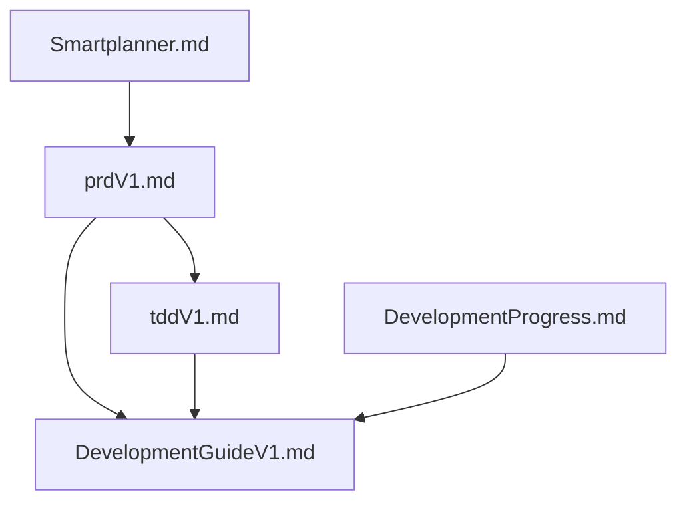

# SmartPlanner 项目结构说明

## 文档目录 (SmartPlannerDoc/)
### 迭代文档 (iteration_v1/)
- `prdV1.md` - 产品需求文档
  - 产品定位
  - 功能需求
  - 非功能需求
  - UI/UX设计规范
  - 兼容性要求
  - 发布计划
  
- `tddV1.md` - 技术设计文档
  - 系统架构设计
  - 数据模型设计
  - 核心类设计
  - 安全设计
  - 性能优化
  - 测试策略

- `DevelopmentGuideV1.md` - 开发步骤指南
  - 详细开发流程
  - 具体实现步骤
  - 时间规划
  - 注意事项

### 核心文档
- `Smartplanner.md` - 项目整体说明
  - 设计初衷
  - 核心功能模块
  - 技术架构
  - 前后端职责划分

- `DevelopmentProgress.md` - 开发进度追踪
  - 已完成功能
  - 进行中的任务
  - 待办事项
  - 问题记录

## 源代码目录 (SmartPlanner/)
### 当前项目结构
- `SmartPlanner.xcodeproj/` - Xcode 项目配置文件

- `SmartPlanner/` - 主项目目录
  - `SmartPlannerApp.swift` - 应用程序入口文件
  - `ContentView.swift` - 主视图文件
  - `Assets.xcassets/` - 资源文件目录
  - `Preview Content/` - SwiftUI 预���内容
  - `SmartPlanner.xcdatamodeld/` - Core Data 数据模型
  - `Models/` - 数据模型层
    - 负责数据实体定义
    - 数据转换和持久化
    - 业务模型
  - `Views/` - 视图层
    - 用户界面组件
    - 页面布局
    - 交互控件
  - `ViewModels/` - 视图模型层
    - 视图状态管理
    - 业务逻辑处理
    - 数据绑定
  - `Services/` - 服务层
    - `CoreData/` - CoreData 服务
      - `CoreDataManager.swift` - CoreData 核心管理类
        - 实现单例模式
        - 管理 CoreData 栈
        - 提供 CRUD 操作
        - 支持批量操作
  - `Utilities/` - 工具层
    - 通用工具类
    - 扩展方法
    - 常量定义

- `SmartPlannerTests/` - 单元测试目录
  - `SmartPlannerTests.swift` - 单元测试文件

- `SmartPlannerUITests/` - UI测试目录
  - `SmartPlannerUITests.swift` - UI测试用例
  - `SmartPlannerUITestsLaunchTests.swift` - 启动测试用例

### 建议的项目结构
建议在 `SmartPlanner/` 主项目目录下采用以下结构：
- `Models/` - 数据模型层
  - 负责数据实体定义
  - 数据转换和持久化
  - 业务模型

- `Views/` - 视图层
  - 用户界面组件
  - 页面布局
  - 交互控件

- `ViewModels/` - 视图模型层
  - 视图状态管理
  - 业务逻辑处理
  - 数据绑定

- `Services/` - 服务层
  - 网络请求
  - 数据存储
  - 业务服务

- `Utilities/` - 工具层
  - 通用工具类
  - 扩展方法
  - 常量定义

建议在 `SmartPlannerTests/` 目录下包含：
- 模型测试
- 业务逻辑测试
- 工具类测试

建议在 `SmartPlannerUITests/` 目录下包含：
- 界面交互测试
- 用户流程测试
- 性能测试

### Xcode 项目配置
- `SmartPlanner.xcodeproj/` - Xcode 项目配置文件
  - 构建设置
  - 依赖管理
  - 签名配置
  - 环境配置

## 文件依赖关系

```mermaid
graph TD
    PRD[prdV1.md] --> TDD[tddV1.md]
    PRD --> DG[DevelopmentGuideV1.md]
    TDD --> DG
    Smartplanner[Smartplanner.md] --> PRD
    DP[DevelopmentProgress.md] --> DG
```

## 版本控制
- `.gitignore` - Git忽略文件配置
- `LICENSE` - GNU General Public License v3.0
- `README.md` - 项目说明文档
- `ProjectStructure.md` - 项目结构说明文档
