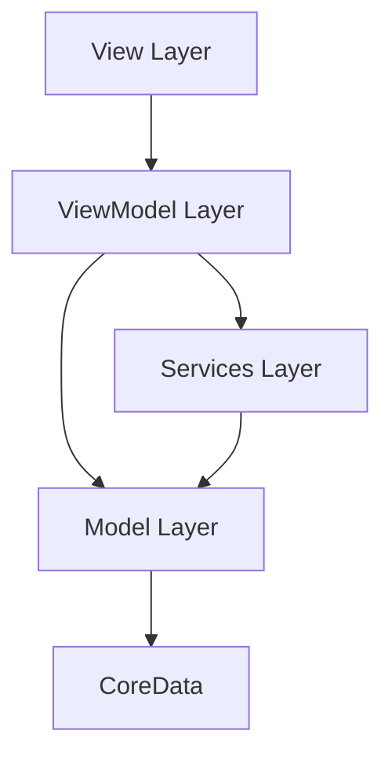
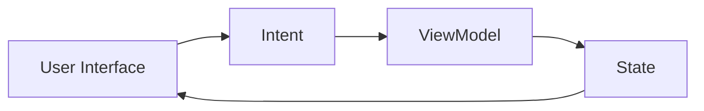

# SmartPlanner 技术设计文档 (TDD)
版本：1.0.1
最后更新：2024-01-17
状态：草稿

## 1. 文档信息
- 文档状态：草稿
- 技术负责人：[待定]
- 相关产品文档：PRD v1.0.0

## 2. MVVM架构设计

### 2.1 技术选型
- 开发语言：Swift 6.0
- UI框架：SwiftUI
- 状态管理：Combine
- 持久化：CoreData
- 网络：URLSession, WebSocket
- 依赖管理：Swift Package Manager
- 构建工具：Xcode 16

### 2.2 MVVM架构概述


#### 2.2.1 模型层（Model Layer）
- Core Data实体
- 数据传输对象（DTOs）
- 数据验证规则
- 业务逻辑模型

#### 2.2.2 视图层（View Layer）
- SwiftUI视图
- UI组件
- 用户输入处理
- 视图特定动画

#### 2.2.3 视图模型层（ViewModel Layer）
- 状态管理
- 数据转换
- 业务逻辑
- 命令处理
- 数据绑定

#### 2.2.4 服务层（Services Layer）
- 数据服务
- 网络服务
- 实用服务
- 系统服务

### 2.3 核心组件

#### 2.3.1 日历模块
```swift
// MARK: - Model
struct CalendarData {
    var selectedDate: Date
    var events: [PlanInstance]
    var zones: [PlanningZone]
}

// MARK: - ViewModel
class CalendarViewModel: ObservableObject {
    @Published private(set) var calendarData: CalendarData
    private let planManager: PlanManager
    private let zoneManager: ZoneManager
    
    // MARK: - Intent Methods
    func selectDate(_ date: Date)
    func loadEvents()
    func updateEvent(_ event: PlanInstance)
}

// MARK: - View
struct CalendarView: View {
    @StateObject private var viewModel: CalendarViewModel
    
    var body: some View {
        VStack {
            CalendarHeaderView(...)
            CalendarContentView(...)
            CalendarToolbarView(...)
        }
    }
}
```

#### 2.3.2 计划模块
```swift
// MARK: - Model
struct PlanningData {
    var templates: [PlanTemplate]
    var instances: [PlanInstance]
    var categories: [PlanCategory]
}

// MARK: - ViewModel
class PlanningViewModel: ObservableObject {
    @Published private(set) var planningData: PlanningData
    private let planManager: PlanManager
    
    // MARK: - Intent Methods
    func createPlan(_ plan: PlanTemplate)
    func updatePlan(_ plan: PlanInstance)
    func deletePlan(_ plan: PlanInstance)
}

// MARK: - View
struct PlanningView: View {
    @StateObject private var viewModel: PlanningViewModel
    
    var body: some View {
        VStack {
            PlanListView(...)
            PlanDetailView(...)
            PlanToolbarView(...)
        }
    }
}
```

### 2.4 数据流

#### 2.4.1 单向数据流


#### 2.4.2 状态管理
```swift
// MARK: - State Management
class AppState: ObservableObject {
    @Published var calendarState: CalendarState
    @Published var planningState: PlanningState
    @Published var categoryState: CategoryState
}

// MARK: - State Types
struct CalendarState {
    var selectedDate: Date
    var viewMode: CalendarViewMode
    var events: [PlanInstance]
}

struct PlanningState {
    var selectedPlan: PlanInstance?
    var templates: [PlanTemplate]
    var instances: [PlanInstance]
}
```

## 3. 详细实现

### 3.1 Core Data模型

#### 3.1.1 实体关系
```swift
// MARK: - Core Data Models
class PlanTemplate: NSManagedObject {
    @NSManaged var id: UUID
    @NSManaged var name: String
    @NSManaged var category: PlanCategory?
    @NSManaged var instances: Set<PlanInstance>
}

class PlanInstance: NSManagedObject {
    @NSManaged var id: UUID
    @NSManaged var template: PlanTemplate?
    @NSManaged var startTime: Date
    @NSManaged var endTime: Date
    @NSManaged var status: String
}
```

### 3.2 视图模型

#### 3.2.1 基础视图模型协议
```swift
protocol BaseViewModel: ObservableObject {
    associatedtype State
    associatedtype Intent
    
    var state: State { get }
    func handle(_ intent: Intent)
}
```

#### 3.2.2 具体视图模型
```swift
class CalendarViewModel: BaseViewModel {
    typealias State = CalendarState
    typealias Intent = CalendarIntent
    
    @Published private(set) var state: State
    private let planManager: PlanManager
    
    func handle(_ intent: Intent) {
        switch intent {
        case .selectDate(let date):
            updateSelectedDate(date)
        case .changeViewMode(let mode):
            updateViewMode(mode)
        }
    }
}
```

### 3.3 视图

#### 3.3.1 视图协议
```swift
protocol BaseView: View {
    associatedtype VM: BaseViewModel
    var viewModel: VM { get }
}
```

#### 3.3.2 具体视图
```swift
struct CalendarView: BaseView {
    @StateObject var viewModel: CalendarViewModel
    
    var body: some View {
        VStack {
            switch viewModel.state.viewMode {
            case .month:
                MonthView(viewModel: viewModel)
            case .week:
                WeekView(viewModel: viewModel)
            case .day:
                DayView(viewModel: viewModel)
            }
        }
    }
}
```

## 4. 测试策略

### 4.1 单元测试
- 模型测试
- 视图模型测试
- 服务测试
- 实用测试

### 4.2 集成测试
- 模块集成测试
- 数据流测试
- 服务集成测试

### 4.3 UI测试
- 视图测试
- 用户流程测试
- 性能测试

## 5. 性能优化

### 5.1 UI性能
- 视图复用
- 懒加载
- 内存管理
- 动画优化

### 5.2 数据性能
- 批量操作
- 缓存策略
- 查询优化
- 后台处理

## 6. 安全设计

### 6.1 数据安全
- CoreData加密
- 安全存储
- 数据备份
- 访问控制

### 6.2 网络安全
- SSL/TLS
- 证书绑定
- 请求签名
- 令牌管理

## 7. 部署策略

### 7.1 环境设置
- 开发
- 测试
- 预发布
- 生产

### 7.2 发布流程
- 代码审查
- 自动化测试
- 构建流程
- 分发

## 8. 监控

### 8.1 性能监控
- 启动时间
- 响应时间
- 内存使用
- CPU使用率

### 8.2 错误监控
- 崩溃报告
- 错误跟踪
- 用户反馈
- 性能警报

## 9. 附录

### 9.1 技术栈详情
- Swift 6.0
- SwiftUI
- Combine
- CoreData
- URLSession
- WebSocket

### 9.2 第三方依赖
- TBD

### 9.3 修订历史
| 版本  | 日期       | 修改内容           | 作者   |
|------|------------|-------------------|--------|
| 1.0.1| 2024-01-17| MVVM架构更新        | [作者] |
| 1.0.0| 2024-01-17| 初始版本创建        | [作者] |
