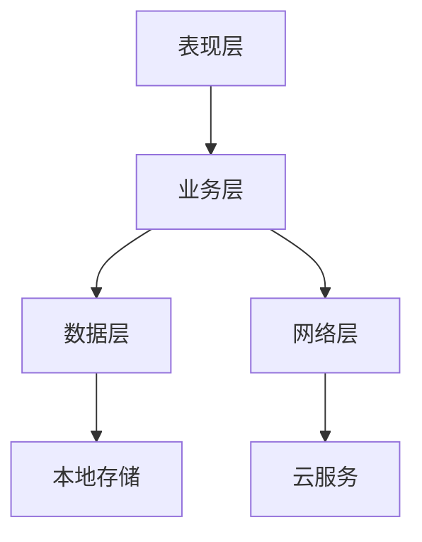
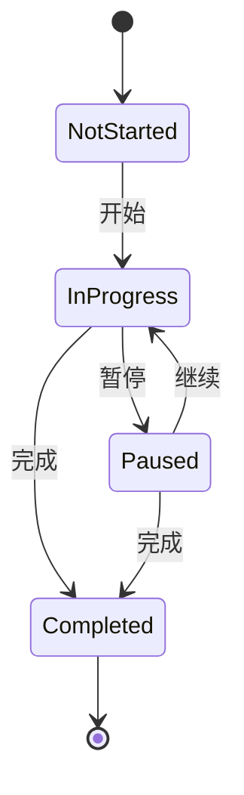
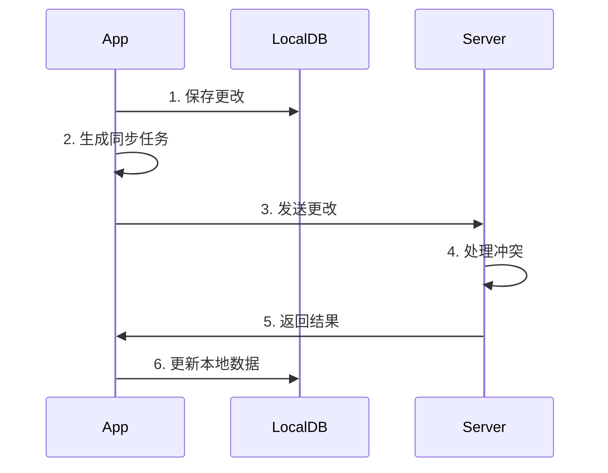

# SmartPlanner 技术设计文档 (TDD)
版本：1.0.0
最后更新：2024-01-17
状态：草稿

## 1. 文档信息
- 文档状态：草稿
- 技术负责人：[待定]
- 相关产品文档：PRD v1.0.0

## 2. 系统架构

### 2.1 技术选型
- 开发语言：Swift 6.0
- 开发框架：SwiftUI, Combine
- 数据持久化：CoreData
- 网络通信：URLSession, WebSocket
- 依赖管理：Swift Package Manager
- 构建工具：Xcode 16

### 2.2 系统组件


#### 2.2.1 表现层（Presentation Layer）
- Views：SwiftUI视图
- ViewModels：MVVM架构
- UIKit组件集成
- 动画系统

#### 2.2.2 业务层（Business Layer）
- 计划管理服务
- 时间管理服务
- 数据分析服务
- 通知服务

#### 2.2.3 数据层（Data Layer）
- CoreData管理
- 数据同步服务
- 缓存管理
- 数据迁移

#### 2.2.4 网络层（Network Layer）
- API服务
- WebSocket服务
- 网络状态管理
- 错误处理

### 2.3 核心模块

#### 2.3.1 日历模块
- 自定义日历视图
- 时间轴管理
- 拖拽系统
- 手势识别

#### 2.3.2 计划管理模块
- 计划CRUD
- 模板管理
- 重复规则处理
- 提醒系统

#### 2.3.3 数据同步模块
- 增量同步
- 冲突解决
- 离线支持
- 数据压缩

## 3. 详细设计

### 3.1 数据模型

#### 3.1.1 计划区间模型（PlanningZone）
```swift
class PlanningZone: NSManagedObject {
    @NSManaged var id: UUID
    @NSManaged var name: String
    @NSManaged var color: String
    @NSManaged var startTime: Date
    @NSManaged var endTime: Date
    @NSManaged var isTemplate: Bool
    @NSManaged var plans: Set<Plan>
    @NSManaged var recurrenceRule: RecurrenceRule?
    @NSManaged var createdAt: Date
    @NSManaged var updatedAt: Date
}
```

#### 3.1.2 计划模型（Plan��
```swift
class Plan: NSManagedObject {
    @NSManaged var id: UUID
    @NSManaged var name: String
    @NSManaged var startTime: Date
    @NSManaged var endTime: Date
    @NSManaged var isTemplate: Bool
    @NSManaged var category: Category?
    @NSManaged var planningZone: PlanningZone?
    @NSManaged var reminder: Reminder?
    @NSManaged var recurrenceRule: RecurrenceRule?
    @NSManaged var isFixedTime: Bool
    @NSManaged var priority: Int16
    @NSManaged var difficulty: Int16
    @NSManaged var status: String
    @NSManaged var createdAt: Date
    @NSManaged var updatedAt: Date
}
```

#### 3.1.3 类别模型（Category）
```swift
class Category: NSManagedObject {
    @NSManaged var id: UUID
    @NSManaged var name: String
    @NSManaged var color: String
    @NSManaged var parentCategory: Category?
    @NSManaged var subCategories: Set<Category>
    @NSManaged var plans: Set<Plan>
    @NSManaged var createdAt: Date
    @NSManaged var updatedAt: Date
}
```

#### 3.1.4 重复规则模型（RecurrenceRule）
```swift
class RecurrenceRule: NSManagedObject {
    @NSManaged var id: UUID
    @NSManaged var type: String // daily, weekly, monthly
    @NSManaged var interval: Int16
    @NSManaged var daysOfWeek: String? // "1,2,3,4,5"
    @NSManaged var startDate: Date
    @NSManaged var endDate: Date?
    @NSManaged var count: Int16?
}
```

### 3.2 核心类设计

#### 3.2.1 计划管理器（PlanManager）
```swift
class PlanManager: ObservableObject {
    // MARK: - Properties
    private let coreDataStack: CoreDataStack
    private let notificationManager: NotificationManager
    
    // MARK: - Public Methods
    func createPlan(_ plan: Plan) async throws
    func updatePlan(_ plan: Plan) async throws
    func deletePlan(_ plan: Plan) async throws
    func startPlan(_ plan: Plan) async throws
    func pausePlan(_ plan: Plan) async throws
    func completePlan(_ plan: Plan) async throws
    
    // MARK: - Private Methods
    private func handlePlanOvertime(_ plan: Plan)
    private func adjustFollowingPlans(_ plan: Plan)
    private func generateRecurrencePlans(_ template: Plan)
}
```

#### 3.2.2 区间管理器（ZoneManager）
```swift
class ZoneManager: ObservableObject {
    // MARK: - Properties
    private let coreDataStack: CoreDataStack
    
    // MARK: - Public Methods
    func createZone(_ zone: PlanningZone) async throws
    func updateZone(_ zone: PlanningZone) async throws
    func deleteZone(_ zone: PlanningZone) async throws
    func assignPlanToZone(_ plan: Plan, zone: PlanningZone) async throws
    
    // MARK: - Private Methods
    private func validateZoneTime(_ zone: PlanningZone) -> Bool
    private func handleZoneConflicts(_ zone: PlanningZone)
}
```

### 3.3 UI组件设计

#### 3.3.1 日历视图（CalendarView）
```swift
struct CalendarView: View {
    @StateObject private var viewModel: CalendarViewModel
    @State private var selectedDate: Date
    @State private var viewMode: CalendarViewMode
    
    var body: some View {
        VStack {
            // Calendar header
            CalendarHeaderView(...)
            
            // Calendar grid
            switch viewMode {
            case .month:
                MonthView(...)
            case .week:
                WeekView(...)
            case .day:
                DayView(...)
            }
            
            // Time indicator
            if viewMode != .month {
                CurrentTimeIndicator(...)
            }
        }
    }
}
```

#### 3.3.2 计划视图（PlanView）
```swift
struct PlanView: View {
    @ObservedObject var plan: Plan
    @State private var isEditing: Bool
    
    var body: some View {
        VStack {
            // Plan header
            HStack {
                Text(plan.name)
                Spacer()
                StatusIndicator(status: plan.status)
            }
            
            // Time info
            if !plan.isTemplate {
                TimeInfoView(start: plan.startTime, end: plan.endTime)
            }
            
            // Action buttons
            if plan.status == .inProgress {
                HStack {
                    PauseButton(...)
                    CompleteButton(...)
                }
            }
        }
        .background(plan.category?.color ?? .gray)
    }
}
```

### 3.4 业务流程设计

#### 3.4.1 计划执行流程


#### 3.4.2 数据同步流程


## 4. 安全设计

### 4.1 数据安全
- 使用Keychain存储敏感信息
- 数据库加密
- 网络传输加密
- 数据备份策略

### 4.2 访问控制
- 用户认证
- 权限管理
- 设备管理
- 会话控制

## 5. 性能优化

### 5.1 UI性能
- 视图复用机制
- 懒加载策略
- 图片缓存
- 动画优化

### 5.2 数据性能
- 数据预加载
- 缓存策略
- 批量操作优化
- 索引优化

## 6. 测试策略

### 6.1 单元测试
- 模型测试
- 业务逻辑测试
- 工具类测试
- 边界条件测试

### 6.2 集成测试
- 模块集成测试
- 数据流测试
- API测试
- 性能测试

## 7. 部署方案

### 7.1 环境配置
- 开发环境
- 测试环境
- 预发布环境
- 生产环境

### 7.2 发布流程
- 代码审查
- 自动化测试
- 打包发布
- 灰度发布

## 8. 监控方案

### 8.1 性能监控
- 启动时间
- 页面响应时间
- 内存使用
- CPU使用率

### 8.2 错误监控
- 崩溃日志
- 错误追踪
- 用户反馈
- 性能警报

## 9. 附录

### 9.1 技术栈清单
- Swift 6.0
- SwiftUI
- Combine
- CoreData
- URLSession
- WebSocket

### 9.2 第三方依赖
- 待定

### 9.3 修订历史
| 版本  | 日期       | 修改内容           | 作者   |
|------|------------|-------------------|--------|
| 1.0.0| 2024-01-17| 初始版本创建        | [作者] |
